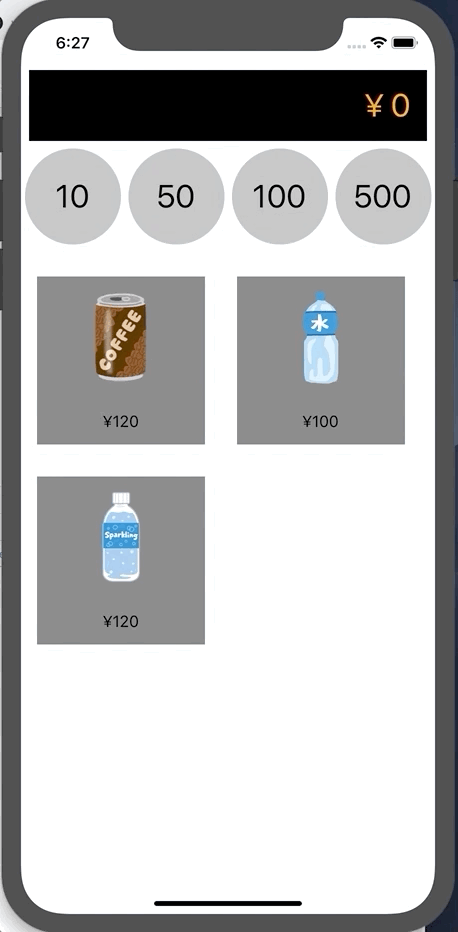

# vapor-architecture

## Video



## Getting Started

Install dependencies.

```console
yarn
yarn bootstrap
```

Start a server.

```console
cd modules/server
yarn start
```

Start a client. Open Xcode project under modules/client/ios/ and `Run`

## Showing numbers of sold drinks

Access http://localhost:3000/items

## Exposition

This is a 16th article for [React Native Advent Calendar](https://qiita.com/advent-calendar/2018/react-native).

Followings are my thoughts of an architecture to build apps in multi-platform for now.

### clean architecture

The "clean architecture" is proposed by [Uncle Bob](https://twitter.com/unclebobmartin).

http://blog.cleancoder.com/uncle-bob/2012/08/13/the-clean-architecture.html

Primary merit is suited for development by team. This merit is leaded by separation of codes corresponding to its responsibilities.

In this repository, codes responds to each roles in clean architecture are following paths.

roles in clean architecture | paths
---|---
Entities                | [/modules/domain/src](https://github.com/januswel/vapor-architecture/tree/master/modules/domain/src)
Use Cases               | [/modules/client/src/modules/buy-and-count](https://github.com/januswel/vapor-architecture/blob/master/modules/client/src/modules/buy-and-count.ts)
Interface Adaptors      | [/modules/client/src/selectors](https://github.com/januswel/vapor-architecture/tree/master/modules/client/src/selectors), [/modules/client/src/modules/](https://github.com/januswel/vapor-architecture/blob/master/modules/client/src/modules)
Frameworks and Drivers  | [/modules/client](https://github.com/januswel/vapor-architecture/tree/master/modules/client), [/modules/server](https://github.com/januswel/vapor-architecture/tree/master/modules/server)

### DDD

"DDD" is a famous framework of thoughts proposed by [Eric Evans](https://twitter.com/ericevans0).

https://domainlanguage.com/ddd/

In this repository, use only a Repository pattern: A pattern to input / output data to / from Entities.

Entity is also described in Eric Evans's DDD book, but those are discussions in context of object oriented. I wrote codes for Entities in context of function oriented, in order to get used to CQRS and event sourcing, there are some of differences between both.

https://github.com/januswel/vapor-architecture/blob/master/modules/domain/src/vending-machine.ts

### CQRS

CQRS: Command Query Responsibility Segregation reduces complexity of software systems.

https://martinfowler.com/bliki/CQRS.html

Redux is a one of implementations of CQRS: Dispatching actions are Commands to store and props are Queries to store.

I use Redux actions to command to a server.

https://github.com/januswel/vapor-architecture/blob/master/modules/client/src/modules/buy-and-count.ts

I think this design makes sense, because Entities are global in my all apps.

### Event sourcing

https://martinfowler.com/eaaDev/EventSourcing.html

> Event Sourcing ensures that all changes to application state are stored as a sequence of events.

Event sourcing is effective to adopt CQRS. Redux actions and reducers are just a sample of event sourcing.

### ~domain~ Entities modeling

I picked vending machine up as a theme to model. Coins, drinks, items and vending machine are modeled in this repo. Modeling vending machine is recommended by [かとじゅん](https://twitter.com/j5ik2o)

### View Model

Mappings from Entities to View Model is a one of Interface Adaptors. I use the `reselect` package to suite Entities for React components.

## Summary

Frameworks and libraries are bovine rather than thoughts and ideas about design to develop apps. I'm delightful if you get somethings from this repo.
